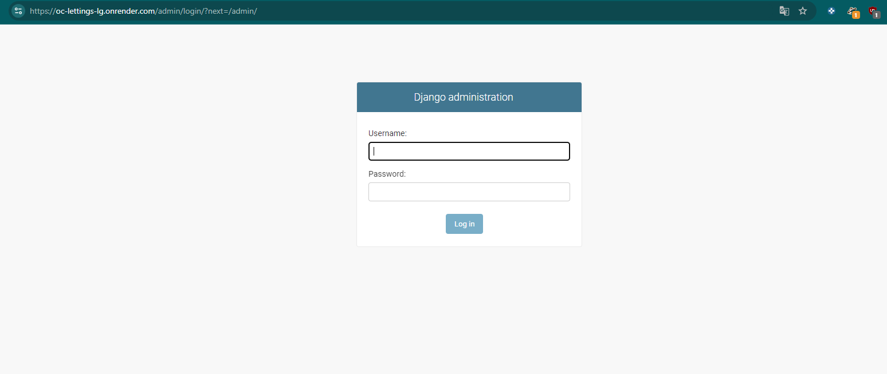

Déploiement sur Render
======================

Dans cette section, nous allons expliquer comment déployer l'application OC Lettings sur Render, un hébergeur PaaS (Platform as a Service) qui permet de facilement déployer des applications web basées sur Docker (ou autre). 
Le pipeline de CI/CD configuré avec GitHub Actions gère le processus de test, la construction des images Docker, et le déploiement final sur Render.

Prérequis
---------------------
Avant de commencer le déploiement sur Render, vous aurez besoin de :

- **Un compte Render** : Inscrivez-vous sur https://render.com/ si vous n'avez pas encore de compte.
- **Un repository GitHub** : Assurez-vous que le repository contenant votre projet OC Lettings est bien connecté à Render.
- **Docker Hub** : Votre application est conteneurisée et les images sont hébergées sur Docker Hub. Assurez-vous d'avoir un compte Docker Hub avec les bonnes permissions.

Étapes de déploiement
------------------------

1. Création du projet sur Render
.............................

Pour commencer, suivez les étapes suivantes pour créer un nouveau service web sur Render :

1. **Créer un nouveau service** : 
   - Allez sur votre tableau de bord Render.
   - Cliquez sur **New** puis sélectionnez **Web Service**.

2. **Configurer l'image Docker** :
   - Sélectionnez l'option **Use Docker**.
   - Dans le champ de l'**URL de l'image Docker**, indiquez l'image Docker taguée que vous voulez utiliser. Par exemple, `docker.io/ggui/oc_lettings:latest` ou en spécifiant le `commit hash` pour une version spécifique.

**Ceci est pour le premier déploiement, la suite se fera tout seul avec le Hook !**

3. **Définir les variables d'environnement** :
   - Ajoutez les clés d'environnement nécessaires dans Render pour assurer que votre application fonctionne correctement :
     - `SECRET_KEY`
     - `SENTRY_DSN`
     - `DEBUG` a "False"
     - `DOCKER_USERNAME`
     - `DOCKER_PASSWORD`

2. Intégration avec Docker Hub et GitHub Actions
.............................

L'application OC Lettings est configurée pour être automatiquement déployée depuis GitHub via GitHub Actions et Docker Hub. Voici comment cela fonctionne :

1. **Pipeline CI/CD sur GitHub Actions** : 
   - Chaque fois que vous effectuez un commit sur la branche `main`, GitHub Actions effectue les étapes suivantes :
     - Exécute les tests unitaires et d'intégration.
     - Construit une image Docker à partir du code et l'envoie à Docker Hub.
     - Si tout est réussi, il déclenche le déploiement sur Render en utilisant l'image Docker fraîchement construite.

.. image:: img/deploy.PNG

2. **Utilisation des tags Docker** :
   - Le pipeline utilise deux types de tags pour les images Docker :
     - Le tag `latest`, qui pointe toujours vers la version la plus récente de l'image.
     - Un tag spécifique basé sur le hash du commit, par exemple : `oc_lettings:{{ github.sha }}`. Cela permet d'identifier précisément chaque version de l'application.

.. image:: img/docker-hist.PNG

3. **Déploiement via un webhook Render** :
   - GitHub Actions utilise un webhook pour déclencher automatiquement le déploiement sur Render à partir de l'image Docker la plus récente (en reprennant la valeur du hash donné lors du build (marche aussi en utilisant le latest)). Voici un extrait de configuration dans le fichier `.yml` :

.. code-block:: yaml

   deploy:
     runs-on: ubuntu-latest
     needs: build-docker
     steps:
       - name: Déploiement sur Render
         uses: gh-actions-workflows/deploy-docker-render@v1.1
         with:
           deploy-hook: ${{ secrets.RENDER_DEPLOY_HOOK }}
           image-url: "docker.io/${{ secrets.DOCKER_USERNAME }}/oc_lettings:${{ github.sha }}"
           render-api-key: ${{ secrets.RENDER_API_KEY }}

Le hook sur render :

Gérer les fichiers statiques en production
------------------------------------------

L'une des étapes importantes lors du déploiement est de s'assurer que les fichiers statiques (CSS, JavaScript, images) sont bien servis. Pour ce faire :

1. **Utilisation de WhiteNoise** :
   - Le projet utilise **WhiteNoise** pour servir efficacement les fichiers statiques en production.
   - WhiteNoise est configuré dans le fichier `settings.py` :

.. code-block:: python

     MIDDLEWARE = [
         ...
         'whitenoise.middleware.WhiteNoiseMiddleware',
         ...
     ]

  Au besoin utilisé :

.. code-block:: python

     STATICFILES_STORAGE = 'whitenoise.storage.CompressedManifestStaticFilesStorage'

2. **Exécution de la commande collectstatic** :
   - La commande `collectstatic` est exécutée lors du déploiement pour rassembler tous les fichiers statiques dans le dossier `staticfiles` :

.. code-block:: bash

     python manage.py collectstatic --noinput

Monitoring des erreurs avec Sentry
-----------------------------------

Pendant et après le déploiement, il est crucial de surveiller les erreurs via **Sentry**. 
Le projet est intégré à Sentry, ce qui permet de remonter toutes les erreurs rencontrées en production. 
La clé Sentry est configurée dans les variables d'environnement.

Exemple en utilisant la page erreur 500 qui créé volontairement une erreur :

.. image:: img/500servererror.PNG

.. image:: img/error500sentry.PNG

Après déploiement
-------------------------------

Une fois le déploiement terminé :

- L'application est bien en ligne et accessible à l'URL publique de Render.

.. image:: img/dep-home-access.PNG

- Les fichiers statiques se chargent correctement.

- L'interface d'administration est fonctionnelle.

- Les erreurs remontent bien dans Sentry.

.. image:: img/sentry-home.PNG

Render :

