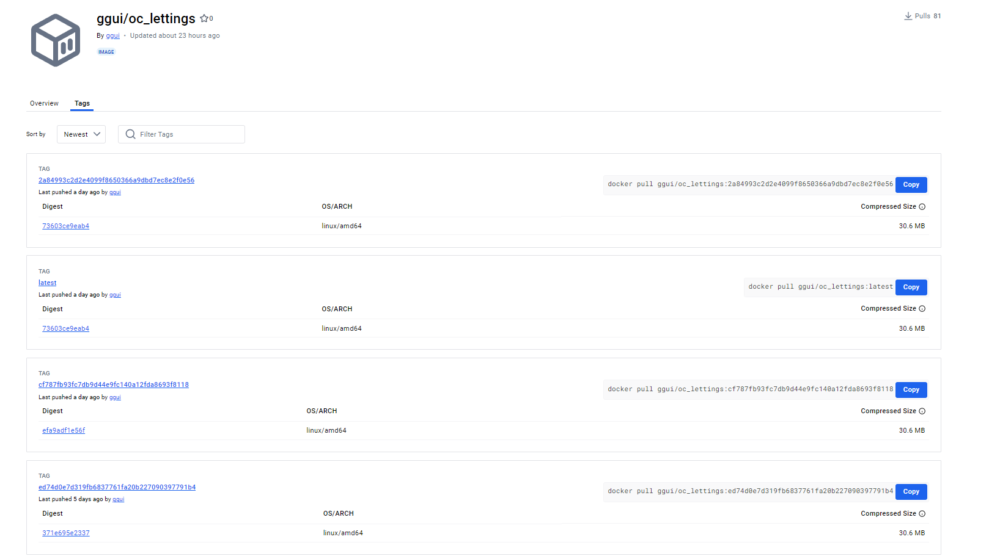

Image du projet sur Docker
==========================

Le projet **OC Lettings** est conteneurisé à l'aide de Docker, ce qui permet de faciliter son déploiement, son exécution en local, ainsi que la gestion des dépendances et des versions. 

Le pipeline CI/CD sur GitHub Actions prend en charge la création de l'image Docker, son tag, et son envoi vers Docker Hub.

Processus de création de l'image Docker
---------------------------------------

Le fichier `Dockerfile` est situé à la racine du projet et définit les étapes nécessaires à la création de l'image Docker. Voici un aperçu des principales étapes définies dans le fichier `Dockerfile` :

1. **Utilisation de l'image de base** :
   - Le projet utilise une image de base légère basée sur **python:3.9-alpine**

2. **Installation des dépendances** :
   - Le Dockerfile installe les dépendances définies dans le fichier `requirements.txt` via pip.

3. **Collecte des fichiers statiques** :
   - La commande `collectstatic` est exécutée pour rassembler tous les fichiers statiques (CSS, JavaScript, images) dans le dossier `staticfiles`.

4. **Exécution** :
   - Une fois l'image Docker construite, elle est prête être utiiser.

Voici un exemple de `Dockerfile` utilisé pour le projet :

.. code-block:: dockerfile

  FROM python:3.9-alpine

  ENV PYTHONUNBUFFERED=1

  WORKDIR /

  COPY requirements.txt /

  RUN pip install --no-cache-dir -r requirements.txt

  COPY . /

  ARG SECRET_KEY
  ARG DEBUG
  ARG SENTRY_DSN

  RUN python manage.py collectstatic --noinput --clear

  EXPOSE 8000

  CMD ["python", "manage.py", "runserver", "0.0.0.0:8000"]

Création et tag de l'image Docker
---------------------------------

Le pipeline CI/CD est configuré pour automatiser la création et le tag de l'image Docker à chaque fois qu'un commit est effectué sur la branche `main`. Voici les étapes faites avec GitHub Actions :

1. **Construction de l'image Docker** :
   - La commande `docker build` est utilisée pour créer l'image Docker à partir du `Dockerfile`.

2. **Tag de l'image Docker** :
   - Deux tags sont appliqués à chaque image Docker :
     - `latest` : ce tag pointe toujours vers la version la plus récente de l'image Docker.
     - `commit hash` : chaque commit génère un hash unique qui est utilisé pour taguer l'image Docker, permettant ainsi de garder une trace de chaque version.

Commandes exécutées pour la création et le tag de l'image Docker :

.. code-block:: bash

   docker build \
            --build-arg SECRET_KEY="${{ secrets.SECRET_KEY }}" \
            --build-arg SENTRY_DSN="${{ secrets.SENTRY_DSN }}" \
            -t ${{ secrets.DOCKER_USERNAME }}/oc_lettings:latest .
          docker tag ${{ secrets.DOCKER_USERNAME }}/oc_lettings:latest ${{ secrets.DOCKER_USERNAME }}/oc_lettings:${{ github.sha }}

Envoi de l'image Docker sur Docker Hub
--------------------------------------

Une fois l'image Docker construite et taguée, elle est envoyée sur Docker Hub pour qu'elle puisse être utilisée lors du déploiement :

.. code-block:: bash

   docker push ${{ secrets.DOCKER_USERNAME }}/oc_lettings:latest
   docker push ${{ secrets.DOCKER_USERNAME }}/oc_lettings:${{ github.sha }}

Utilisation locale de l'image Docker
------------------------------------

Il est possible de récupérer l'image Docker du projet depuis Docker Hub pour l'exécuter localement :

1. **Récupérer l'image Docker** :

.. code-block:: bash

   docker pull ggui/oc_lettings:latest

2. **Lancer le conteneur Docker** :

.. code-block:: bash

   docker run -d -p 8000:8000 ggui/oc_lettings:latest

   # Ou pour une version spécifique avec un tag hash de commit
   docker run -d -p 8000:8000 ggui/oc_lettings:${{ github.sha }}

Cela permettra de lancer l'application avec http://localhost:8000, et vous pourrez interagir avec l'application en local via Docker sans avoir à installer toutes les dépendances sur votre machine.

