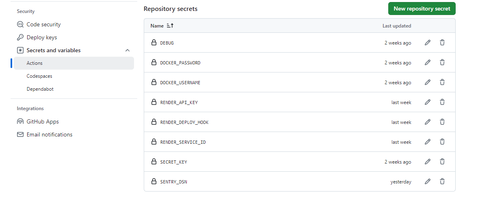

Le stockage de clé et mot de passe dans un environnement de production
======================================================================

Dans le cadre du déploiement de l'application en production, il est indispensable de sécuriser les clés sensibles (comme la `SECRET_KEY` ou `SENTRY_DSN`) et les mots de passe afin de garantir la sécurité des données et du système. Cette section décrit les bonnes pratiques de gestion des informations sensibles et leur mise en place via les solutions **Render** et **GitHub Secrets**.

Bonnes pratiques de sécurité
----------------------------

Dans un environnement de production, la gestion des clés et mots de passe doit suivre les principes suivants :

- **Stockage sécurisé via des variables d'environnement** : Les informations sensibles ne doivent jamais être directement incluses dans le code source ou les fichiers de configuration partagés. L'utilisation de variables d'environnement est préconisée pour s'assurer que ces informations restent confidentielles.
  
- **Isolation des clés pour chaque environnement** : Les clés doivent être définies séparément pour les environnements de développement, de test et de production afin d'éviter des fuites potentielles entre ces environnements.

- **Rotation périodique des clés** : Les clés et les mots de passe doivent être régulièrement mis à jour afin de minimiser les risques liés à des fuites ou à des attaques.

- **Accès restreint aux variables sensibles** : Seuls les administrateurs ou utilisateurs autorisés doivent pouvoir accéder aux informations sensibles via les outils de déploiement.

Utilisation des variables d'environnement sur Render
-------------------------------------

Sur **Render**, il est possible de stocker les clés API et les mots de passe dans l'environnement sécurisé de l'application :

1. **Définition des variables d'environnement** :

   Dans le tableau de bord Render,  dans les paramètres de l'application sous l'onglet **Environment**. On Ajoute les clés nécessaires, telles que `SECRET_KEY`, `SENTRY_DSN`, et également pour `DOCKER`.

.. image:: img/env-render.PNG

2. **Accès aux variables dans l'application** :

   Les variables sont récupérées dans le fichier `settings.py` via la méthode `os.getenv()` :

   .. code-block:: python

      import os

      SECRET_KEY = os.getenv('SECRET_KEY')
      SENTRY_DSN = os.getenv('SENTRY_DSN')

3. **Utilisation sécurisée lors du déploiement** :

   Lors du déploiement de l'application, les variables sont utilisées automatiquement par le moteur de Render, garantissant que les clés sensibles ne sont pas exposées publiquement.

Stockage sécurisé des clés sur GitHub avec GitHub Secrets
---------------------------------------------------------

Lors de l'automatisation des workflows CI/CD avec **GitHub Actions**, il est nécessaire de stocker les clés et mots de passe dans **GitHub Secrets**. Ces secrets sont sécurisés et accessibles uniquement aux workflows configurés.

Les secrets sur GitHub :

1. **Accés à GitHub Secrets** :

   - Dans votre dépôt GitHub, allez dans l'onglet **Settings**.
   - Cliquez sur **Secrets and variables** > **Actions**.

2. **Ajouter un secret** :

   - Cliquez sur le bouton **New repository secret**.

   - Ajoutez les secrets nécessaires :
     - `DOCKER_USERNAME`
     - `DOCKER_PASSWORD`
     - `RENDER_API_KEY`
     - `SECRET_KEY`

2. **Intégration dans les workflows CI/CD** :

   Les secrets ajoutés sont utilisés dans les workflows via `${{ secrets.SECRET_NAME }}`. 

Ici selon le build docker de notre config.yml et l'intégration avec GitHub Actions :

  .. code-block:: yaml

    build-docker:
        runs-on: ubuntu-latest
        needs: build-and-test
        steps:
          - name: Checkout the code
            uses: actions/checkout@v2

          - name: Log in to Docker Hub
            run: echo "${{ secrets.DOCKER_PASSWORD }}" | docker login --username ${{ secrets.DOCKER_USERNAME }} --password-stdin

          - name: Build and tag Docker image
            run: |
              docker build \
                --build-arg SECRET_KEY="${{ secrets.SECRET_KEY }}" \
                --build-arg SENTRY_DSN="${{ secrets.SENTRY_DSN }}" \
                -t ${{ secrets.DOCKER_USERNAME }}/oc_lettings:latest .
              docker tag ${{ secrets.DOCKER_USERNAME }}/oc_lettings:latest ${{ secrets.DOCKER_USERNAME }}/oc_lettings:${{ github.sha }}

          - name: Push Docker image
            run: |
              docker push ${{ secrets.DOCKER_USERNAME }}/oc_lettings:latest
              docker push ${{ secrets.DOCKER_USERNAME }}/oc_lettings:${{ github.sha }}

3. **Gestion et mise à jour des secrets** :

   Les secrets stockés dans GitHub sont cryptés et ne peuvent pas être récupérés après leur ajout. En cas de besoin de modification, ils doivent être mis à jour ou supprimés pour garantir leur sécurité.

