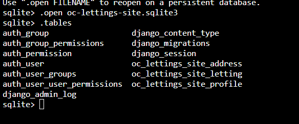

Structure de la Base de Données
===============================

Le projet utilise une base de données SQLite.

Voici quelques instructions pour interagir avec la base de données SQLite utilisée par le projet.

### Connexion à la base de données

Pour accéder à la base de données SQLite, exécutez les commandes suivantes depuis le répertoire racine du projet :

.. code-block:: bash

    cd /path/to/Python-OC-Lettings-FR
    sqlite3

Cela ouvrira une session SQLite où vous pourrez exécuter des requêtes directement sur la base de données.

### Se connecter à la base de données du projet

Pour vous connecter à la base de données du projet, exécutez la commande suivante :

.. code-block:: bash

    .open oc-lettings-site.sqlite3

### Afficher les tables

Pour lister toutes les tables présentes dans la base de données, utilisez la commande suivante :

.. code-block:: bash

    .tables

### Obtenir des informations sur une table

Pour afficher les colonnes d'une table spécifique (par exemple, la table des profils), utilisez la commande suivante :

.. code-block:: bash

    pragma table_info(profiles_profile);

Cela affichera les colonnes et les types de données associés de la table `profiles_profile`.

### Requête SQL sur la base de données

Vous pouvez exécuter des requêtes SQL classiques. Par exemple, pour récupérer l'identifiant utilisateur et la ville favorite des utilisateurs dont la ville commence par la lettre "B", vous pouvez exécuter la commande suivante :

.. code-block:: sql

    select user_id, favorite_city from profiles_profile where favorite_city like 'B%';

### Quitter SQLite

Pour quitter l'interface SQLite, utilisez simplement la commande :

.. code-block:: bash

    .quit
