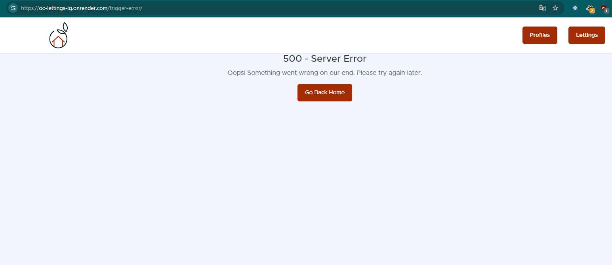
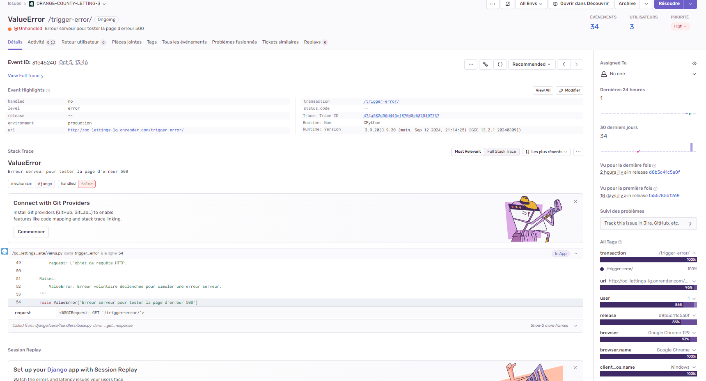
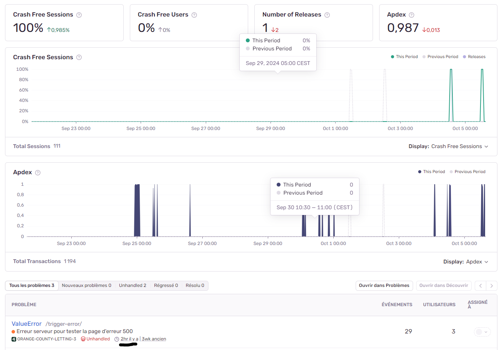
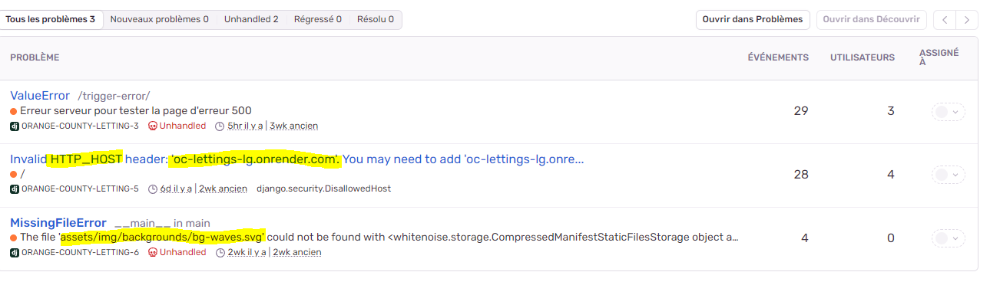

Surveillance des Erreurs avec Sentry
====================================

L'intégration de Sentry permet de surveiller les erreurs en production de manière automatisée. 

En utilisant Sentry, les erreurs non gérées qui se produisent dans l'application sont automatiquement capturées et signalées sur le dashboard de Sentry. 

Intégration de Sentry
---------------------

Sentry est intégré directement dans le projet via le fichier `settings.py`. L'intégration se fait en utilisant le SDK Python de Sentry, et la configuration est récupérée via les variables d'environnement pour garantir la sécurité des informations sensibles.

Le code suivant montre l'intégration de Sentry dans le fichier `settings.py` :

.. code-block:: python

    import os
    import sentry_sdk
    from sentry_sdk.integrations.django import DjangoIntegration

    sentry_sdk.init(
        dsn=os.getenv("SENTRY_DSN"),  
        integrations=[DjangoIntegration()],
        traces_sample_rate=1.0,
        send_default_pii=True
    )

Cette configuration permet à Sentry de capturer toutes les erreurs non gérées et de fournir des rapports détaillés avec des informations sur le contexte, les utilisateurs affectés, etc.

Gestion Sécurisée des Clés DSN
------------------------------

Pour des raisons de sécurité, la clé DSN utilisée pour connecter le projet à Sentry n'est jamais exposée dans le code source. Elle est stockée sous forme de variable d'environnement. L'accès à cette clé se fait via les services de gestion des secrets comme **GitHub Secrets** ou les variables d'environnement dans **Render**.

Exemple d'utilisation avec une Erreur 500
-----------------------------------------

Lorsqu'une erreur survient dans l'application, comme une erreur serveur (500), elle est automatiquement capturée par Sentry. Cela permet de centraliser toutes les erreurs critiques rencontrées par les utilisateurs finaux. Par exemple, l'erreur 500 peut être déclenchée intentionnellement pour vérifier l'intégration avec Sentry et observer comment l'erreur remonte sur le tableau de bord Sentry.

Voici un exemple d'erreur 500 déclenchée intentionnellement et sa capture par Sentry :

Surveillance Continue des Erreurs
---------------------------------

Grâce à Sentry, on peut suivre en temps réel toutes les erreurs qui surviennent dans l'application. 

Cela inclut :

- Les erreurs 404, lorsque les utilisateurs tentent d'accéder à des pages inexistantes.
- Les erreurs 500, lorsque des problèmes internes surviennent sur le serveur.
- Toutes les exceptions non gérées levées dans l'application.

En plus des rapports d'erreurs, Sentry fournit des outils d'analyse permettant de suivre la fréquence des erreurs, les utilisateurs affectés, et la manière dont les erreurs impactent la performance globale de l'application. (également un suivi avancer des erreurs permettant de trouver la cause et l'endroit en défaut !)

Exemple d'autres erreurs capturé :

 - Hôte non déclaré dans le settings.py de l'app.
 - Fichiers statics manquant ou incorrect.

