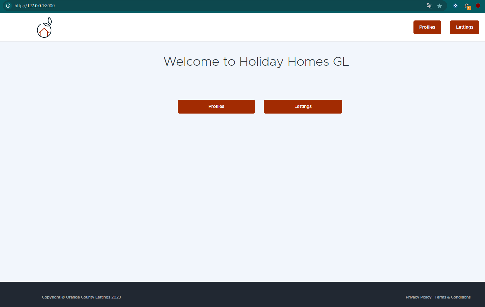
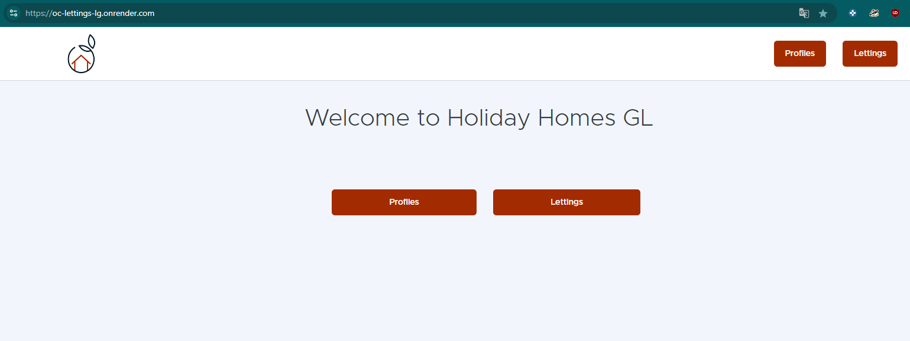
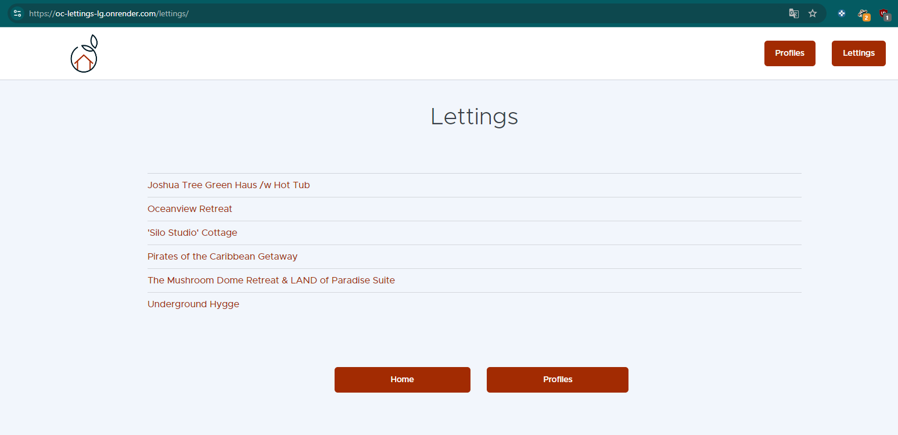
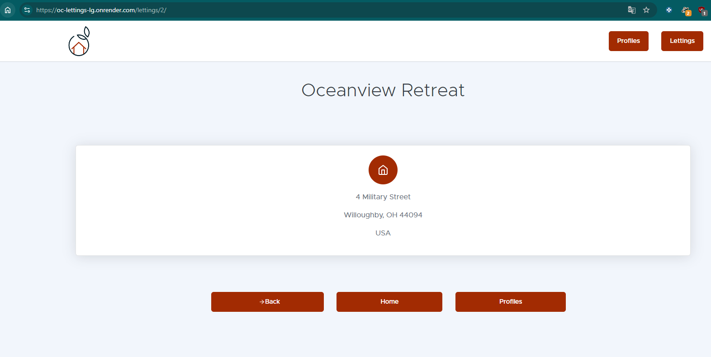
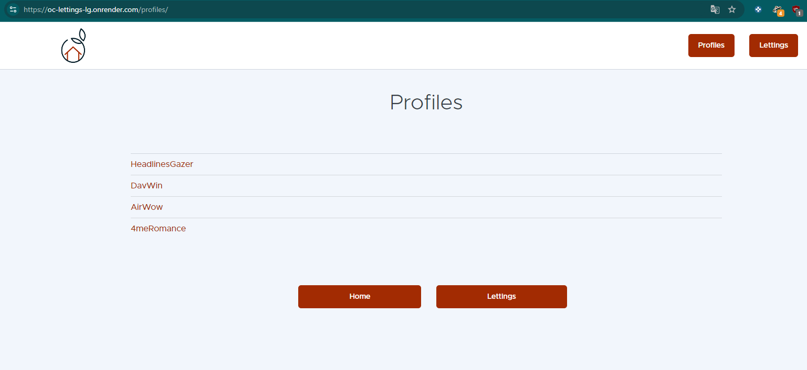
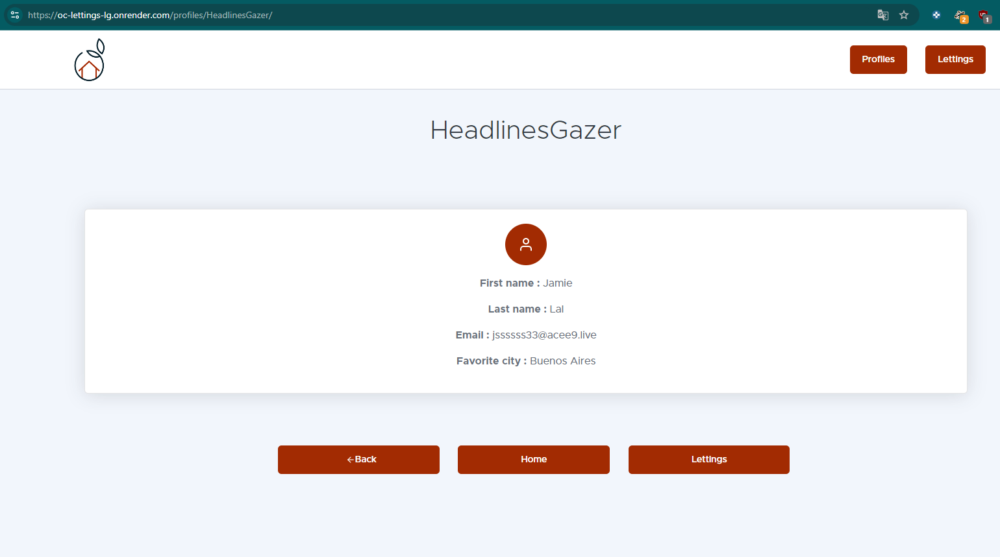
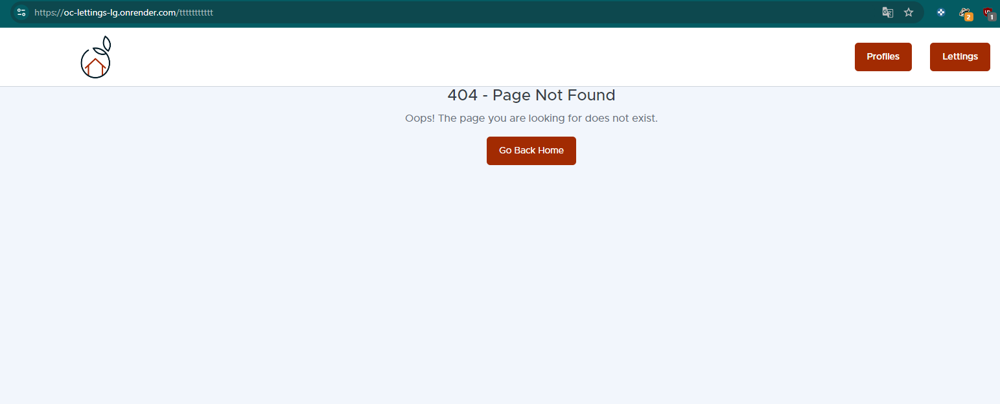
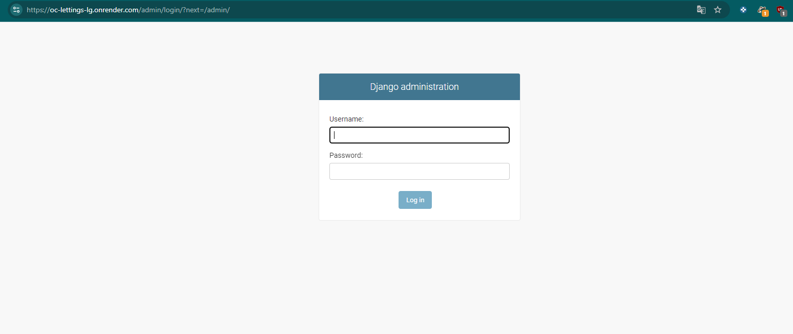
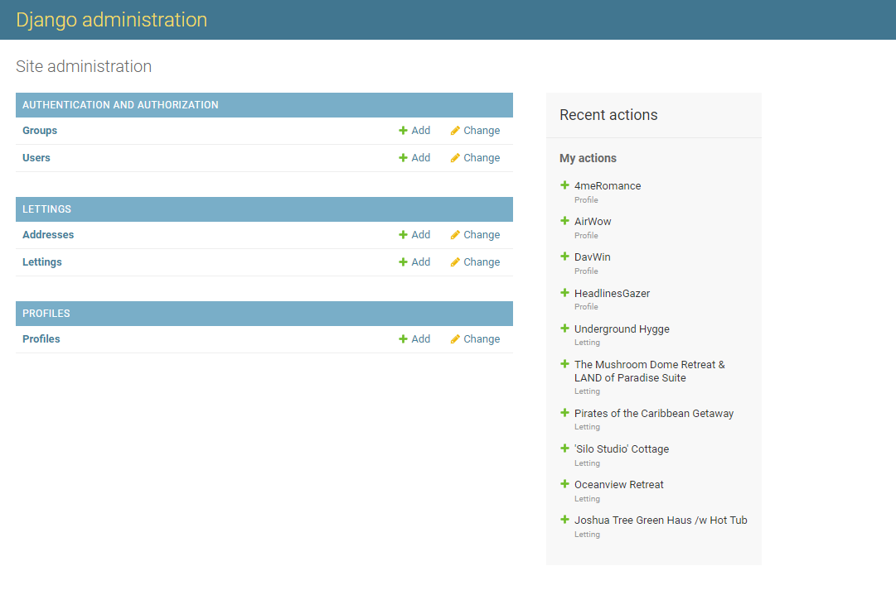

URLs et Guide d'Utilisation
============================

Cette section regroupe toutes les URLs et liens utiles pour l'utilisation et le déploiement de l'application **OC Lettings**. Ces liens incluent les chemins d'accès aux différentes sections du site, ainsi que des ressources utiles pour le déploiement et la gestion du projet.

URLs de l'Application (local et production)
----------------------

L'application **OC Lettings** comporte plusieurs sections accessibles via des URLs spécifiques. Voici une liste des principales URLs disponibles dans l'application :

- **Page d'accueil** : 
  
.. code-block:: bash

    http://127.0.0.1:8000/

.. code-block:: bash

    https://oc-lettings-lg.onrender.com/

- **Section Lettings** : 
  
.. code-block:: bash

    http://127.0.0.1:8000/lettings/

.. code-block:: bash

    https://oc-lettings-lg.onrender.com/lettings/

- **Détails d'un Letting** : 
  
.. code-block:: bash

    http://127.0.0.1:8000/lettings/<id_letting>/

.. code-block:: bash

    https://oc-lettings-lg.onrender.com/lettings/<id_letting>/

- **Section Profils** : 
  
.. code-block:: bash

    http://127.0.0.1:8000/profiles/

.. code-block:: bash

    https://oc-lettings-lg.onrender.com/profiles/

- **Détails d'un Profil** : 

.. code-block:: bash

    http://127.0.0.1:8000/profiles/<username>/

.. code-block:: bash

    https://oc-lettings-lg.onrender.com/profiles/<username>/

- **Page Erreur 404 (Non Trouvé)** : 

  .. code-block:: bash

    https://oc-lettings-lg.onrender.com/tttttttt/

- **Page Erreur 500 (Erreur Serveur)** : 

  .. code-block:: bash

    https://oc-lettings-lg.onrender.com/500/

.. image:: img/500servererror.PNG

Ces URLs sont les routes principales permettant de naviguer entre les différentes sections de l'application en local ou sur le serveur déployé.

Utilisation de l'Interface Admin
--------------------------------

L'application dispose également d'une interface d'administration Django, accessible via l'URL suivante :

- **Admin Panel** : 

  .. code-block:: bash

    https://oc-lettings-lg.onrender.com/admin/

L'interface admin permet la gestion des profils, des locations (lettings), et des utilisateurs.

Ces URLs sont les routes principales permettant de naviguer entre les différentes sections de l'application en local ou sur le serveur déployé.

Liens Publics et Utiles
-----------------------

- **GitHub Repository** : 
  Le code source du projet est accessible sur GitHub. Vous pouvez y accéder via le lien suivant :

  .. code-block:: bash

    https://github.com/El-GuiGui/P13-Mettez-a-l-echelle-une-application-Django-en-utilisant-une-architecture-modulaire

- **Documentation Read the Docs** : 
  La documentation complète du projet est publiée sur Read the Docs et peut être consultée à l'adresse suivante :

  .. code-block:: bash

    https://orange-county-lettings-documentation-lg.readthedocs.io/fr/latest/

- **Docker Hub** : 
  L'image Docker de l'application est hébergée sur Docker Hub, accessible ici :

  .. code-block:: bash

    https://hub.docker.com/r/ggui/oc_lettings/tags

Déploiement en Ligne
--------------------

L'application est déployée via **Render**, et la version en production est accessible à l'URL suivante :

- **URL de Production** : 

  .. code-block:: bash

    https://oc-lettings-lg.onrender.com/

Cette URL permet d'accéder à la version déployée de l'application.

