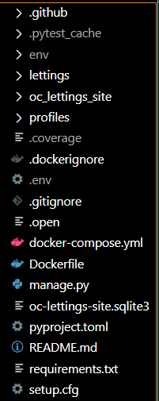
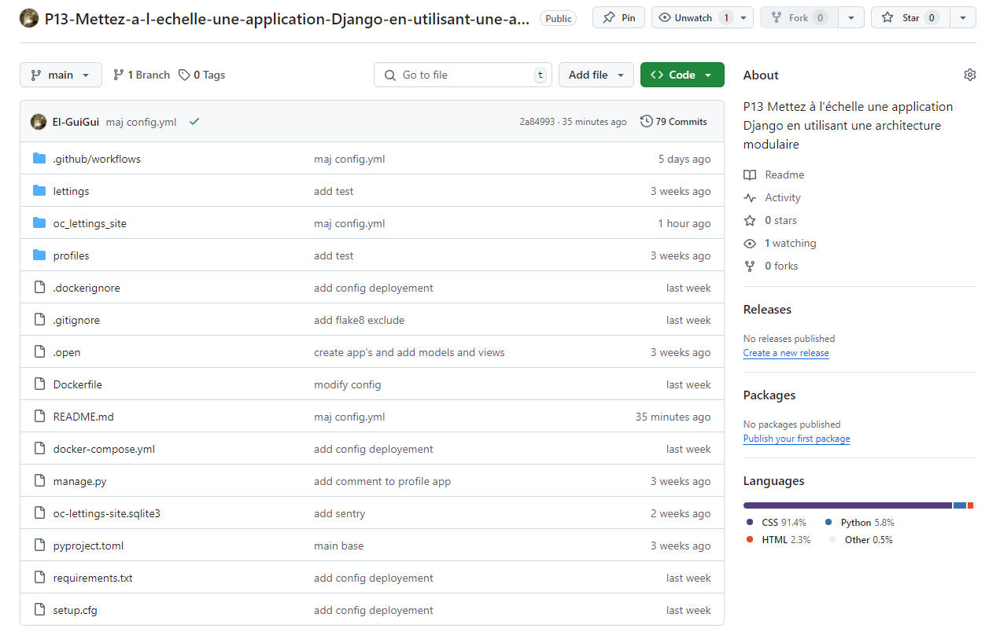
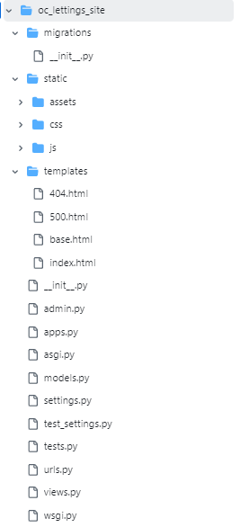
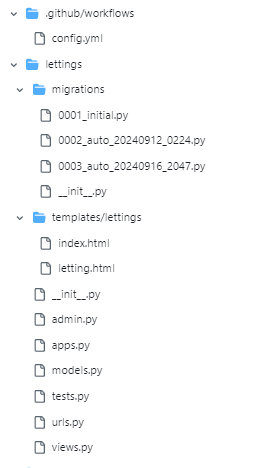
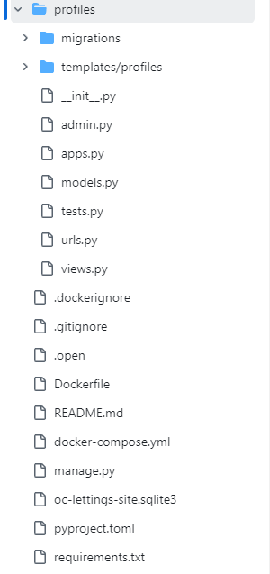

Structure du Projet
====================

L'application est composée de trois sous-applications principales, chacune avec une structure Django typique.

1. **oc_lettings_site** : L'application principale qui contient la logique de gestion des fichiers statiques, les configurations générales et les templates globaux.
2. **lettings** : Cette application gère tout ce qui concerne les locations, avec un modèle de données propre et des vues pour afficher les locations.
3. **profiles** : Cette application s'occupe de la gestion des profils d'utilisateurs, avec des modèles, des vues et des URL spécifiques.

.. code-block:: text

   /
   ├── oc_lettings_site/
   │   ├── static/
   │   ├── templates/
   │   ├── migrations/
   │   ├── models.py
   │   ├── views.py
   │   ├── settings.py
   │   ├── urls.py
   │   ├── asgi.py
   │   └── wsgi.py
   ├── lettings/
   │   ├── migrations/
   │   ├── templates/
   │   ├── models.py
   │   ├── views.py
   │   ├── urls.py
   │   ├── admin.py
   │   └── tests.py
   ├── profiles/
   │   ├── models.py
   │   ├── migrations/
   │   ├── views.py
   │   ├── urls.py
   │   ├── admin.py
   │   └── tests.py

1. Racine du projet
-------------------

Dans la racine du projet, nous trouvons plusieurs fichiers et dossiers essentiels au fonctionnement global :

- **manage.py** : Le fichier de commande principal pour exécuter des tâches Django telles que le lancement du serveur.
- **Dockerfile** et **docker-compose.yml** : Ces fichiers sont utilisés pour la configuration Docker afin de conteneuriser l'application.
- **pyproject.toml** et **setup.cfg** : Fichiers de configuration Python pour la gestion des dépendances et le formatage du code.
- **.env** : Ce fichier contient les variables d'environnement, telles que les clés API et les secrets.
- **oc-lettings-site.sqlite3** : La base de données SQLite utilisée localement pour stocker les données.

2. .github Directory
---------------------

- **workflows/config.yml** : Ce fichier est responsable du pipeline CI/CD du projet. Il contient la configuration pour les tests, la création des images Docker, et le déploiement sur Render.

3. Application oc_lettings_site
-------------------------------

Cette application contient les éléments principaux du projet :

- **migrations/** : Ce dossier contient les fichiers de migration générés par Django pour appliquer les modifications du modèle à la base de données.
- **static/** : Ce dossier contient les fichiers statiques de l'application, comme les feuilles de style (CSS) et les scripts JavaScript.
  
  - **css/** : Fichiers CSS pour le style de l'application.
  
  - **js/** : Scripts JavaScript.
  
  - **assets/** : Autres ressources telles que les images et icônes utilisées dans l'application.

- **templates/** : Ce dossier contient les fichiers HTML utilisés pour afficher les pages web.
  
  - **404.html, 500.html** : Pages d'erreur personnalisées.
  
  - **base.html** : Modèle de base pour les autres templates HTML.
  
  - **index.html** : Page d'accueil de l'application.

4. Application lettings
------------------------

L'application lettings gère les aspects liés aux annonces de locations :

- **migrations/** : Contient les migrations spécifiques à cette application.
- **templates/lettings/** : Contient les templates liés aux annonces, comme **index.html** pour la page de listing et **letting.html** pour afficher une annonce individuelle.
- **apps.py** : Fichier de configuration de l'application Django.
- **models.py** : Définit les modèles **Letting** et **Address** utilisés pour gérer les annonces et leurs adresses.
- **views.py** : Contient les vues qui contrôlent la logique de l'affichage des annonces et des détails.
- **urls.py** : Définit les routes URL spécifiques à l'application lettings.
- **tests.py** : Fichier contenant les tests unitaires pour les modèles, vues, et URL.

5. Application profiles
------------------------

L'application profiles gère les profils d'utilisateurs :

- **migrations/** : Contient les fichiers de migration spécifiques aux modèles de l'application.
- **templates/profiles/** : Les templates pour afficher la liste des profils (**index.html**) et les détails d'un profil individuel (**profile.html**).
- **apps.py** : Fichier de configuration de l'application Django.
- **models.py** : Définit le modèle **Profile**, représentant les profils d'utilisateurs.
- **views.py** : Contient les vues qui gèrent la logique d'affichage des profils.
- **urls.py** : Définit les routes URL pour accéder aux profils.
- **tests.py** : Contient les tests unitaires pour valider le bon fonctionnement des modèles, vues, et URL de cette application.

